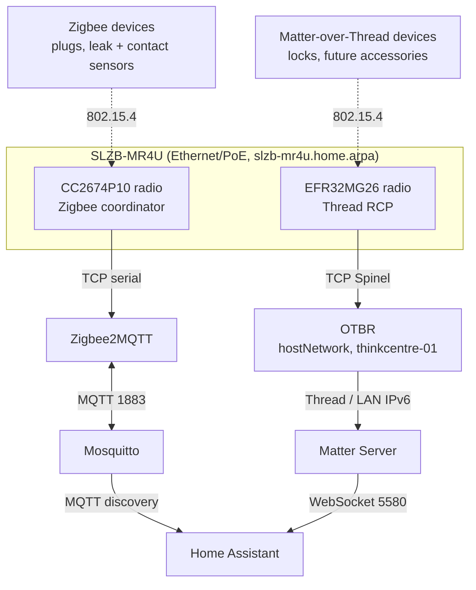

# Home automation

## Architecture and service names

Everything below runs in the `apps` namespace. The production Thread border
router is OTBR in Kubernetes. The SLZB-MR4U is Ethernet/PoE attached and
provides two independent radios — a TI CC2674P10 and a Silicon Labs EFR32MG26.
It does not run OTBR for us, and it must not run single-radio multiprotocol
firmware: Zigbee and Thread each own a radio outright so the two stacks never
contend.



| Interface | Address |
| --- | --- |
| Home Assistant | `https://home-assistant.int.harville.dev` |
| Zigbee2MQTT | `https://zigbee2mqtt.int.harville.dev` |
| MQTT broker | `mqtt://mosquitto.apps.svc.cluster.local:1883` |
| Matter Server | `ws://matter-server.apps.svc.cluster.local:5580/ws` |
| OTBR API | `http://otbr.apps.svc.cluster.local:8081` |

Home Assistant, Matter Server, and OTBR use host networking so they participate
directly in LAN IPv6 and multicast discovery. Matter Server port 5580 and OTBR
port 8081 are consequently reachable on their scheduled nodes' LAN addresses
even though neither has an Ingress. Future UniFi firewall rules must restrict
these ports to Home Assistant and cluster-node sources.

## Before enabling the MR4U workloads

The committed port `0` values are deliberate startup blocks: the init
containers refuse to start rather than connect to an unknown radio. Before
changing them:

1. Give the MR4U a stable DHCP reservation and make
   `slzb-mr4u.home.arpa` resolve from every cluster node.
2. Configure each radio independently in the MR4U UI and record the endpoints
   it reports. Do not infer ports from another SMLIGHT model.
3. Apply the Omni/Terraform machine patch to `thinkcentre-01`; let Omni perform
   the rolling machine update.
4. Verify the node has the `home.harville.dev/otbr=true` label, IPv6 forwarding,
   `/dev/net/tun`, LAN multicast, and an IPv6 default route.

`OTBR_BACKBONE_IF` is already resolved to `eno1`, verified with
`talosctl -n 10.1.10.149 get links` and `... get addresses`: on `thinkcentre-01`
that interface holds both `10.1.10.149/24` and the LAN's global IPv6 `/64`,
which is what border routing needs in order to advertise on-mesh prefixes.
Re-check it if the node's hardware changes.

## MR4U radio allocation and firmware modes

- CC2674P10: Zigbee coordinator, driven by the Zigbee2MQTT `zstack` adapter.
- EFR32MG26: dedicated OpenThread RCP, driven by Kubernetes OTBR.

SMLIGHT's published material does not state which chip the firmware presents as
"Radio 1" versus "Radio 2", and the numbering has differed across models and
firmware revisions. Read the chip name and its TCP port off the MR4U's own UI
and match on the **chipset**, never on the radio number. Pointing Zigbee2MQTT at
the EFR32MG26 is the specific mistake this warning exists to prevent.

Keep Zigbee and Thread on separate radios. Do not install single-radio
multiprotocol firmware. Do not enable the MR4U's beta built-in OTBR while the
Kubernetes OTBR is active: only one OTBR process may own the Thread RCP.

## Configure Zigbee2MQTT

Edit `apps/base/home-automation/zigbee2mqtt.yaml`:

```text
zigbee2mqtt-adapter.data.serial_port
```

Replace `tcp://slzb-mr4u.home.arpa:0` with the exact CC2674P10 Zigbee endpoint
shown by the MR4U. Leave `serial_adapter: zstack`; change `serial_baudrate` only
if the installed Radio 2 firmware requires it. Port 0 intentionally leaves the
init container unavailable rather than connecting to an unknown radio.

After Flux reconciles, open the Zigbee2MQTT UI, enable permit-join for a short
window, pair one device at a time, assign a stable friendly name, disable
permit-join, and verify its Home Assistant MQTT discovery entities.

## Configure OTBR and verify IPv6/TUN

Edit `apps/base/home-automation/otbr.yaml`:

```text
otbr-config.data.RCP_HOST
otbr-config.data.RCP_PORT
otbr-config.data.RCP_BAUDRATE
otbr-config.data.OTBR_RCP_ADDITIONAL_ARGS
otbr-config.data.OTBR_BACKBONE_IF
```

Set `RCP_PORT` to the exact EFR32MG26 Thread RCP endpoint exposed by the MR4U
and `OTBR_BACKBONE_IF` to the physical LAN interface on `thinkcentre-01`.
Confirm the baud rate and any Spinel/UART arguments against the installed RCP
firmware. The init container rejects port 0, a missing TUN device, an unknown
backbone interface, or disabled IPv6 forwarding, and names the check that
failed in its logs.

Do not initialize a second Thread network if one already exists. Preserve the
active Thread dataset in `otbr-data`, and export its active TLV before upgrades
or migration.

## Add MQTT, Matter, Thread, and OTBR integrations

In Home Assistant, use **Settings > Devices & services > Add integration**:

1. Add MQTT with host `mosquitto.apps.svc.cluster.local`, port `1883`, and the
   Home Assistant identity stored in the SOPS-managed MQTT Secrets.
2. Add Matter using
   `ws://matter-server.apps.svc.cluster.local:5580/ws`.
3. Add OpenThread Border Router using
   `http://otbr.apps.svc.cluster.local:8081`.
4. Confirm Home Assistant discovers the same active Thread dataset exposed by
   OTBR before commissioning Matter-over-Thread devices.

These integrations depend only on the MQTT, Matter WebSocket, and standard
OTBR REST interfaces. Home Assistant does not depend on the OTBR container's
TCP bridge, pseudo-TTY, or Kubernetes implementation details.

## MQTT credentials

The broker runs with `allow_anonymous false`. Two identities exist, and each is
stored twice — once as a hash the broker reads, once as the plaintext its
client needs:

| Secret | Holds |
| --- | --- |
| `mosquitto-passwd` | the broker's `passwd` file: `$7$` PBKDF2-SHA512 hashes for `homeassistant` and `zigbee2mqtt` |
| `mosquitto-clients` | `HOMEASSISTANT_MQTT_USER`/`_PASSWORD` and `ZIGBEE2MQTT_MQTT_USER`/`_PASSWORD` |

Zigbee2MQTT reads its pair straight from `mosquitto-clients`. Home Assistant's
pair is entered once through the MQTT integration UI and then lives in
`.storage`, so the secret is the record of what to type, not a live input.

Both files are SOPS-encrypted and need `SOPS_AGE_KEY_FILE=.agekey`. The two
secrets must be regenerated **together** — a hash and its plaintext are only
meaningful as a pair, and the hash cannot be reversed to recover a lost
password. To rotate, generate the passwd file with the broker's own tool and
write both secrets in one pass:

```bash
export SOPS_AGE_KEY_FILE=.agekey
docker run --rm --entrypoint sh eclipse-mosquitto:2.0.22 -c \
  'touch /tmp/pf && chmod 600 /tmp/pf
   mosquitto_passwd -b /tmp/pf homeassistant "$HA_PW" >/dev/null
   mosquitto_passwd -b /tmp/pf zigbee2mqtt  "$Z2M_PW" >/dev/null
   cat /tmp/pf'
```

then `sops set` the result into `mosquitto-passwd` and the matching plaintexts
into `mosquitto-clients`. Changing either secret rolls the dependent
Deployments, because their SOPS MACs are projected into pod annotations by the
`replacements` in `clusters/homelab/apps/kustomization.yaml`. After rotating,
re-enter the Home Assistant password in the MQTT integration.

## Commission a Matter-over-Thread device

Prerequisites: OTBR is `leader` or `router`, the Matter integration is
connected, and the phone running the Home Assistant companion app is on the
same LAN with IPv6 and mDNS reachable.

1. Confirm the border router is carrying a Thread network:

   ```bash
   kubectl -n apps exec deployment/otbr -- wrap-ot-ctl state
   kubectl -n apps exec deployment/otbr -- wrap-ot-ctl dataset active -x
   ```

2. In Home Assistant, check **Settings > Devices & services > Thread** shows
   this OTBR as a preferred border router with a credential set. Matter
   commissioning hands the device these Thread credentials, so a device cannot
   join before they exist.
3. **Settings > Devices & services > Add integration > Matter**, then scan the
   device's Matter QR code or type its 11-digit pairing code with the companion
   app. Keep the device close to the phone for commissioning; it moves to its
   permanent location afterward.
4. The device joins over Bluetooth for commissioning only, then switches to
   Thread. Verify it afterwards with `wrap-ot-ctl childtable` or by confirming
   the entity still responds once Bluetooth range is gone.

A device already commissioned into another ecosystem must be shared via that
ecosystem's "pair additional controller" flow, which yields a fresh pairing
code; factory-resetting is the alternative and drops the original fabric.

## Home Assistant dashboards and automation editors

Dashboards, automations, scripts, and scenes are **UI-owned runtime state**,
not Git artifacts. Build the household control panel in the browser with
**Overview > Edit dashboard**, and add automations under
**Settings > Automations & scenes**. `default_config` enables all of these
editors, so nothing here needs hand-written YAML.

This is a deliberate boundary rather than a gap. Home Assistant's UI editors
write to `/config/.storage`, so a dashboard cannot be both drag-and-drop
editable and owned by Flux: whichever wrote last would clobber the other. The
same rule the rest of this repository follows applies here — Git owns
infrastructure, persistent storage owns runtime state:

| Owned by Git | Owned by the PVC |
| --- | --- |
| containers, images, resources, probes | dashboards and their layout |
| storage classes and volume claims | automations, scripts, scenes |
| radio endpoints and integrations wiring | paired-device registry, areas |
| `configuration.yaml` base settings | tokens, users, `.storage` |

Everything in the right-hand column lives on `home-assistant-config`, which
uses `longhorn-retain` and is covered by the Longhorn snapshot schedule, so it
survives pod restarts, rescheduling, and cluster upgrades. Those snapshots are
the recovery path for a dashboard someone breaks — see the restore section
below.

To make the panel usable by everyone in the house, assign each device to a room
under **Settings > Areas**; Home Assistant then groups controls by area
automatically, and new lights or plugs appear without redesigning the
dashboard. Create a Home Assistant user per person under **Settings > People**
rather than sharing one login, and use the companion app for phone access.

One-touch shortcuts, including future HVAC actions, are best built as a script
(**Settings > Automations & scenes > Scripts**) and then added to the dashboard
as a button, so the panel stays simple while the logic lives in one place.

Git owns only the mounted base `configuration.yaml`. Do not copy UI-managed
`.storage`, `automations.yaml`, `scripts.yaml`, or `scenes.yaml` into a
ConfigMap or overwrite them during reconciliation.

## MQTT credentials

The broker runs with `allow_anonymous false`. Two identities exist, and each is
stored twice — once as a hash the broker reads, once as the plaintext its
client needs:

| Secret | Holds |
| --- | --- |
| `mosquitto-passwd` | the broker's `passwd` file: `$7$` PBKDF2-SHA512 hashes for `homeassistant` and `zigbee2mqtt` |
| `mosquitto-clients` | `HOMEASSISTANT_MQTT_USER`/`_PASSWORD` and `ZIGBEE2MQTT_MQTT_USER`/`_PASSWORD` |

Zigbee2MQTT reads its pair straight from `mosquitto-clients`. Home Assistant's
pair is entered once through the MQTT integration UI and then lives in
`.storage`, so the secret is the record of what to type, not a live input.

Both files are SOPS-encrypted and need `SOPS_AGE_KEY_FILE=.agekey`. The two
secrets must be regenerated **together** — a hash and its plaintext are only
meaningful as a pair, and the hash cannot be reversed to recover a lost
password. To rotate, generate the passwd file with the broker's own tool and
write both secrets in one pass:

```bash
export SOPS_AGE_KEY_FILE=.agekey
docker run --rm --entrypoint sh eclipse-mosquitto:2.0.22 -c \
  'touch /tmp/pf && chmod 600 /tmp/pf
   mosquitto_passwd -b /tmp/pf homeassistant "$HA_PW" >/dev/null
   mosquitto_passwd -b /tmp/pf zigbee2mqtt  "$Z2M_PW" >/dev/null
   cat /tmp/pf'
```

then `sops set` the result into `mosquitto-passwd` and the matching plaintexts
into `mosquitto-clients`. Changing either secret rolls the dependent
Deployments, because their SOPS MACs are projected into pod annotations by the
`replacements` in `clusters/homelab/apps/kustomization.yaml`. After rotating,
re-enter the Home Assistant password in the MQTT integration.

## Commission a Matter-over-Thread device

Prerequisites: OTBR is `leader` or `router`, the Matter integration is
connected, and the phone running the Home Assistant companion app is on the
same LAN with IPv6 and mDNS reachable.

1. Confirm the border router is carrying a Thread network:

   ```bash
   kubectl -n apps exec deployment/otbr -- wrap-ot-ctl state
   kubectl -n apps exec deployment/otbr -- wrap-ot-ctl dataset active -x
   ```

2. In Home Assistant, check **Settings > Devices & services > Thread** shows
   this OTBR as a preferred border router with a credential set. Matter
   commissioning hands the device these Thread credentials, so a device cannot
   join before they exist.
3. **Settings > Devices & services > Add integration > Matter**, then scan the
   device's Matter QR code or type its 11-digit pairing code with the companion
   app. Keep the device close to the phone for commissioning; it moves to its
   permanent location afterward.
4. The device joins over Bluetooth for commissioning only, then switches to
   Thread. Verify it afterwards with `wrap-ot-ctl childtable` or by confirming
   the entity still responds once Bluetooth range is gone.

A device already commissioned into another ecosystem must be shared via that
ecosystem's "pair additional controller" flow, which yields a fresh pairing
code; factory-resetting is the alternative and drops the original fabric.

## Home Assistant dashboards and automation editors

Home Assistant has two dashboard modes, and the split between them is what
keeps dashboards in Git without Flux and the UI overwriting each other:

| | Storage mode | YAML mode |
| --- | --- | --- |
| Edited via | the UI's **Edit dashboard** button | this repository |
| Stored in | `/config/.storage` on the PVC | `home-assistant-dashboards` ConfigMap |
| Tracked by Git | no | yes |
| Editable in the UI | yes | no, by design |

The default **Overview** stays in storage mode, so the familiar UI editing
workflow is untouched. The **Control** dashboard is YAML mode and is defined in
`apps/base/home-automation/dashboards.yaml`, mounted read-only at
`/config/dashboards/control.yaml`. Editing it means editing that file: Flux
updates the ConfigMap, the kubelet syncs it into the pod within about a minute,
and a browser reload shows the change. No Home Assistant restart is needed.

The Control dashboard is built on Home Assistant's **Areas** strategy, so it is
populated by assigning devices to areas under **Settings > Areas** rather than
by listing entity IDs. That is deliberate: it renders correctly before anything
is paired, and adding lights or plugs later makes them appear without a
dashboard rewrite. When a hand-built view is wanted, add it to that file using
the real entity IDs from **Settings > Devices & services > Entities**; the file
carries a worked example. Household one-touch shortcuts should call a `script.`
entity, so the script stays UI-editable while the button stays in Git.

Automations, scripts, and scenes remain UI-owned and persist on
`home-assistant-config` under `/config` and `.storage`. Git owns only the
mounted base `configuration.yaml` and the YAML dashboards. Do not copy
UI-managed `.storage`, `automations.yaml`, `scripts.yaml`, or `scenes.yaml`
into a ConfigMap or overwrite them during reconciliation.

## Pair a Zigbee device

Pair one device at a time; a joining device is interviewed over the air and
overlapping joins are the usual cause of half-configured devices.

1. Open <https://zigbee2mqtt.int.harville.dev>.
2. **Permit join** -> select a short window. Prefer joining *through* the
   nearest mains-powered router rather than the coordinator when a device will
   live far from the MR4U.
3. Factory-reset the device and trigger its join:
   - **THIRDREALITY Smart Plug Gen3** — hold the button until the LED blinks.
   - **THIRDREALITY Water Leak Sensor** — press the reset button until the LED
     blinks.
4. Wait for the interview to finish. A device that shows no model or endpoints
   has not completed interview; leave it powered and near the mesh.
5. Rename it to its permanent friendly name, then turn permit-join **off**.
6. Confirm the matching entities appeared in Home Assistant via MQTT discovery.

Friendly names are the stable identity used by automations, so set them once,
at pairing time, from the device's actual location. Do not record device IEEE
addresses here before the devices have joined.

| Device | Friendly name |
| --- | --- |
| Leak sensor, washing machine | `leak_washing_machine` |
| Leak sensor, water heater | `leak_water_heater` |
| Leak sensor, dishwasher | `leak_dishwasher` |
| Leak sensor, refrigerator | `leak_refrigerator` |
| Smart Plug Gen3 | name for where it ends up, e.g. `plug_laundry_room` |
| Front door contact | `contact_front_door` |
| Back door contact | `contact_back_door` |

The Smart Plug Gen3 is mains powered and therefore a Zigbee router. Place it
between the MR4U and the battery-powered sensors that report weak link quality;
routing is then negotiated by the mesh. Do not try to pin routes by hand.

## Inspect the Zigbee mesh

In the Zigbee2MQTT UI:

- **Devices** — every joined device, its model, power source, and whether it is
  a Router or End Device.
- **Devices > LQI** — link quality per device. Low values on a battery sensor
  usually mean it needs a nearer router, not a new sensor.
- **Map** — the router/parent topology, rendered from a live scan. Battery
  devices appear attached to whichever router currently parents them.
- The coordinator's own state, firmware, and channel are on **Settings >
  About**.

From the CLI:

```bash
# Coordinator health, radio connection, and joined-device announcements.
kubectl -n apps logs deployment/zigbee2mqtt

# Full device list, including link quality, as retained MQTT state.
kubectl -n apps exec deployment/mosquitto -- \
  mosquitto_sub -h 127.0.0.1 -u zigbee2mqtt -P "$MQTT_PW" \
  -t 'zigbee2mqtt/bridge/devices' -C 1
```

## HomeKit Device and HomeKit Bridge

Use **HomeKit Device** to import an unpaired Apple Home accessory into Home
Assistant with its HomeKit pairing code. Use **HomeKit Bridge** to export
selected Home Assistant entities to Apple Home. Imported accessories must not
be re-exported through HomeKit Bridge, which creates duplicates and routing
loops. Store pairing codes outside Git and back up Home Assistant state before
removing or resetting a pairing.

## ecobee authorization

Add ecobee through Home Assistant's supported integration and complete the
authorization flow in the UI after the thermostat and account are available.
Keep account credentials, application credentials, tokens, and authorization
codes out of Git and SOPS manifests unless the integration explicitly requires
a Kubernetes Secret.

## UniFi Protect service account

Create a dedicated local UniFi account with Protect viewer access and no UniFi
OS administrator role. Add the UniFi Protect integration with the controller's
stable LAN hostname and that account. Grant additional camera permissions only
when an automation needs them; do not use the primary UniFi administrator.

## VLAN and firewall flows

Before moving devices to an IoT VLAN, explicitly permit:

- DNS and NTP from smart-home devices;
- Home Assistant and Matter Server IPv6 unicast, ICMPv6, mDNS, and Matter
  discovery/commissioning traffic;
- required mDNS reflection and SSDP/UPnP discovery between trusted and IoT
  networks;
- `thinkcentre-01` to the MR4U EFR32MG26 Thread RCP TCP endpoint;
- Zigbee2MQTT pods to the MR4U CC2674P10 Zigbee TCP endpoint;
- Home Assistant to the UniFi Protect controller and required cloud endpoints;
- Home Assistant and cluster nodes to Matter Server TCP 5580 and OTBR TCP 8081.

Do not broadly block IPv6 multicast or ICMPv6; Thread routing and Matter
commissioning depend on them. Validate flows before enforcing isolation.

## Persistent volumes, snapshots, and restore order

All five state volumes use `longhorn-retain`: `otbr-data`,
`matter-server-data`, `zigbee2mqtt-data`, `mosquitto-data`, and
`home-assistant-config`. The seven daily Longhorn snapshots are local recovery
points only; there is no off-cluster disaster recovery for these volumes.

Restore in this order: OTBR dataset, Matter fabric, Zigbee2MQTT state,
Mosquitto state, then Home Assistant state. Restore related Thread and Matter
state from compatible points to avoid invalidating commissioned devices.

## Failure behavior

OTBR is eligible only on `thinkcentre-01`; rebooting, draining, or losing that
node interrupts Thread border routing. The PVC and `Recreate` strategy prevent
normal concurrent OTBR instances. Zigbee2MQTT and OTBR intentionally remain
unavailable while their port 0 sentinels are present. Zigbee devices can
continue local mesh behavior during controller downtime, but Home Assistant
events and commands stop. Existing Thread devices may continue local mesh
traffic, but border routing and new commissioning stop when OTBR is down.

## Migrate the Thread dataset to MR4U-hosted OTBR

Use this only when the MR4U's built-in OTBR is considered stable. Never create
a second independent Thread network.

1. Export and securely record the active dataset:
   `kubectl -n apps exec deployment/otbr -- wrap-ot-ctl dataset active -x`.
2. Stop/disable the Kubernetes OTBR Deployment and verify it has released the
   RCP before enabling built-in OTBR on the MR4U.
3. Enable MR4U OTBR and import the same active Thread dataset. Do not create a
   new dataset and do not recommission devices preemptively.
4. Change only Home Assistant's OpenThread Border Router integration URL to
   `http://slzb-mr4u.home.arpa:<OTBR_PORT>`; Matter Server continues using LAN
   IPv6 and its existing WebSocket URL.
5. Verify the dataset identity, OTBR role, existing Matter/Thread devices, and
   automations before deleting or archiving Kubernetes OTBR state.

Rollback by stopping MR4U OTBR before restarting Kubernetes OTBR with its
preserved dataset. At no time may both implementations control the same RCP.

## Runtime verification

```bash
kubectl -n apps get pods -l 'app in (home-assistant,matter-server,mosquitto,otbr,zigbee2mqtt)' -o wide
kubectl -n apps logs deployment/zigbee2mqtt
kubectl -n apps logs deployment/otbr
kubectl -n apps exec deployment/otbr -- wrap-ot-ctl state
kubectl -n apps exec deployment/otbr -- wrap-ot-ctl dataset active -x
kubectl -n apps port-forward service/matter-server 5580:5580
```

Also verify the OTBR API from Home Assistant, Matter WebSocket connectivity,
Zigbee MQTT discovery, IPv6 reachability across the LAN, mDNS discovery from a
commissioning phone, and normal operation after restarting each singleton one
at a time.
